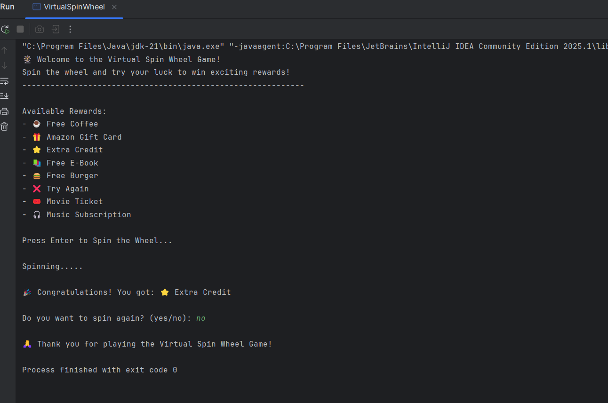

# Virtual Spin Wheel 🎡✨

A fun Java console game where users can spin a virtual wheel and win random rewards!  
This project was created as part of my MotionCut Internship (Week 4 Project).

---

## 🚀 Features
- Displays a list of predefined rewards 🎁
- Spins the wheel and randomly selects a reward using Java's **Random** class
- Fake spinning animation using **Thread.sleep()**
- User can play multiple times until they choose to exit
- Console-based, simple, and interactive

---

## 🖥️ Example Run
```
🎡 Welcome to the Virtual Spin Wheel Game!
Spin the wheel and try your luck to win exciting rewards!
------------------------------------------------------------

Available Rewards:
- ☕ Free Coffee
- 🎁 Amazon Gift Card
- ⭐ Extra Credit
- 📚 Free E-Book
- 🍔 Free Burger
- ❌ Try Again
- 🎟️ Movie Ticket
- 🎧 Music Subscription

Press Enter to Spin the Wheel...
Spinning.....

🎉 Congratulations! You got: 🍔 Free Burger

Do you want to spin again? (yes/no): no
🙏 Thank you for playing the Virtual Spin Wheel Game!
```

---

## 📸 Screenshot
Here’s a screenshot of the console output demo:  

  


---

## ⚙️ How to Run
1. Clone this repository:
   ```bash
   git clone https://github.com/your-username/VirtualSpinWheel.git
   ```
2. Open the project in **IntelliJ IDEA** (or any Java IDE).
3. Navigate to the `src/` folder.
4. Compile and run:
   ```bash
   javac VirtualSpinWheel.java
   java VirtualSpinWheel
   ```

---

## 📚 Concepts Used
- Java **Random** class for random reward selection  
- **Thread.sleep()** for animation effect  
- **Scanner** for user input  
- **Loops** for repeated spins  
- **Arrays** for storing rewards  

---

## ✨ Author
👤 **Sandip Pal**  
- GitHub: [sandip-pal1](https://github.com/sandip-pal1)  
- LinkedIn: [Sandip Pal](https://www.linkedin.com/in/sandip-pal-7877b9285/)  
